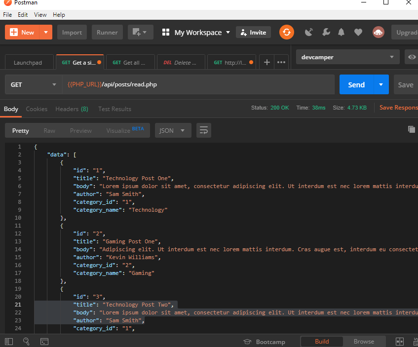
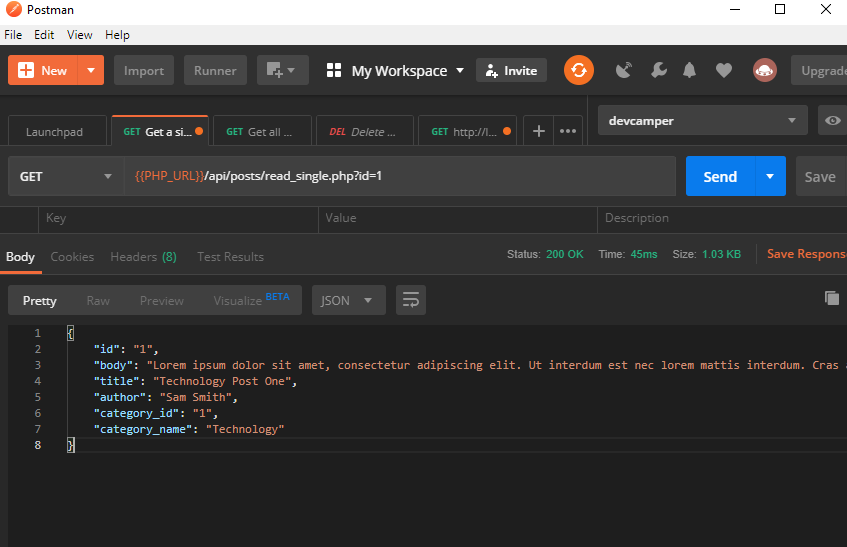
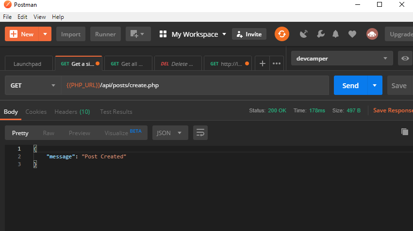
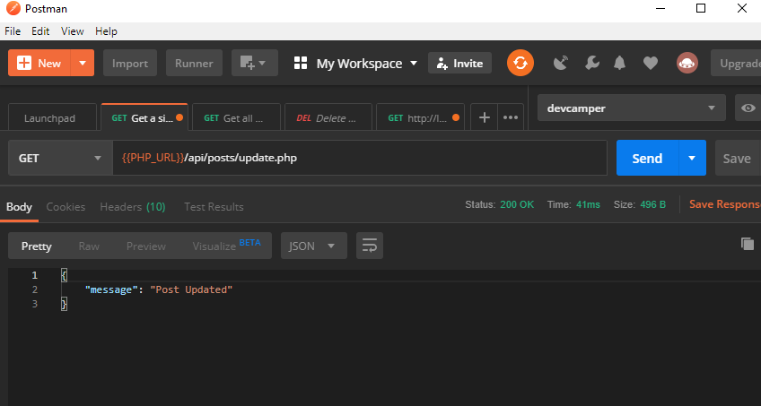
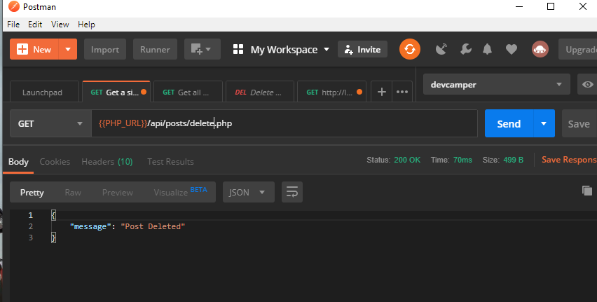

# PHP-REST-API

This is an API based on PHP &amp; MYSQL without any Framework and for the database connection using PDO.

 ## What is it?

This is a simple REST API using PHP and MYSQL. It has all the CRUD (Create Read Update and Delete functionalities for posts. Each post is made of a title, body, post_id(primary key), author name, publish_date, category_id.



## What does it do?

- You can list all posts in database **GET**
- View a single post  **GET**
- Update a post **PUT** using query parameter id as the id of the post
- Create a post **POST**
- Delete a post **DELETE** their articles

## INSTALATION

1. Make sure that you have PHP 5 or above installed in your computer with a MYSQL Database. If you don't... Check out [this link](https://www.apachefriends.org/download.html) Or install a LAMP stack using your favorite method.

2. Clone this repo to your computer better in `C:\xampp\htdocs` for XAMPP users on windows.
```
git clone https://github.com/RedJanvier/PHP-REST-API.git
```
3. Open Database.php in Config folder `config/Database.php` and edit the database name, username, host and password to your own settings or copy [my setup from here](mydb.sql)


## Usage

- Download an HTTP Client such as `Postman or Insomnia` to which will be used to send POST, PUT, GET or DELETE requests.
- Open control panel (for XAMPP users) and start apache and MySQL.
- Use phpMyAdmin to create a categories table and a posts table. you can refer to [mydb.sql](mydb.sql).
- Move the cloned folder (PHP-REST-API) in the location `C:\xampp\htdocs`

- Use your HTTP Client application of choice to send a `GET` request to the url `http://localhost/php-rest-api/api/posts/read.php` to view all the posts in the database.

## Possible Routes


n| Endpoint| Method| Expected Response| payload|
---| ------------- |:-------------:| -----:| ------|
1| /api/posts/read.php| GET| Array of Posts in Database | -|
2| /api/posts/read_single.php     | GET|  Object of a single Post| id (url param)
3| /api/posts/create.php| POST      |  Object with message property | title, body, author name, category id in JSON
4| /api/posts/update.php| PUT|  Object with message property | title, body, author name, category id in JSON
5| /api/posts/delete.php| DELETE|  Object with message property | title, body, author name, category id in JSON

### Response Previews

1. /api/posts/read.php


2. /api/posts/read_single.php?id=1


3. /api/posts/create.php


4. /api/posts/update.php


5. /api/posts/delete.php



# API DEVELOPMENT

## Tools:

- Server-side Framework: **PHP**
- Database : **MySQL**

## Other Tools:

- Postman
- Text Editor (VSCode)
- XAMPP

---


If POSTMAN is not installed in your computer, DOWNLOAD it [here](https://www.getpostman.com/apps)

## Instructions to modify the API

navigate to the PHP-REST-API folder and in your terminal, type:

```
git checkout -b branchnameforyourchanges
```
Make changes andthen type:

```
git add .
```

then

```
git commit -m "your commit message"
```

and push like so

```
git push origin branchnameforyourchanges
```

# Author:

**RedJanvier**

[RedJanvier](http://github.com/RedJanvier/) - Github
[RedJanvier](http://facebook.com/ntwali.h.janvier) - Facebook
janvierntwali@gmail.com - Gmail


